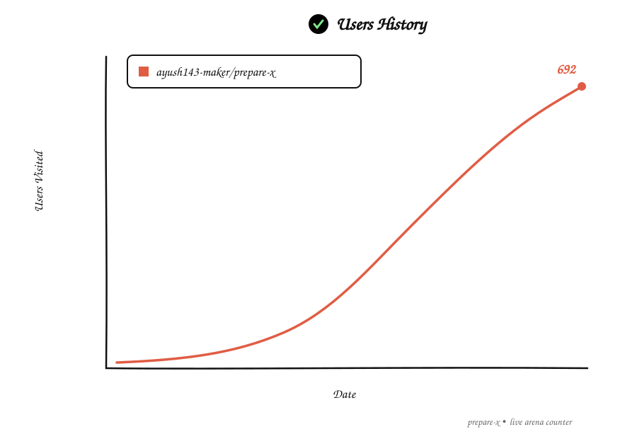

<div align="center">



# CUET PREP ARENA

### Practice that feels like the *real exam.*

[](https://nextjs.org)
[](https://www.typescriptlang.org)
[](https://tailwindcss.com)
[](https://zustand.docs.pmnd.rs)
[](https://vercel.com)

[](#)
[](#-the-arsenal)
[](#-the-arsenal)
[](#-the-arsenal)
[](#-license)

</div>

<br>

> **No signup. No fees. Sirf practice.**
> Timed quizzes · Real PYQ shift papers · Negative marking · Topic-wise analytics · Exam ka pressure, browser me.

---

## 🎯 What is this?

CUET Prep Arena ek exam-simulator hai jo CUET UG ke **real pattern** pe practice karwata hai — same timing, same **+5 / −1** marking, same pressure. Koi login nahi, koi paywall nahi. Bas kholo, subject chuno, aur ladna shuru karo.

```bash
git clone https://github.com/ayush143-maker/prepare-x.git
cd prepare-x
npm install
npm run dev
# → http://localhost:3000
```

---

## 🔥 Feature Blitz

| Feature | What it does |
|---|---|
| Exam Timer | Real exam wala countdown, auto-submit ke saath |
| PYQ Mode | Real shift papers, paper-wise attempt |
| Practice Mode | Subject + topic + difficulty filters ke saath custom quiz |
| Negative Marking | +5 / −1 — bilkul CUET wala drama |
| Analytics Dashboard | Accuracy, weak topics, attempt history |
| Mark for Review | Real exam jaisi navigation palette |
| Animated UI | Moving grid, aurora glows, spotlight, shimmer |
| Responsive | Phone se laptop tak, kahin bhi lao |

---

## 📚 The Arsenal

| Subject | PYQ (Real Shifts) | Practice Bank | Total |
|---|:---:|:---:|:---:|
| English | 100 | 100 | **200** |
| Physics | 100 | 100 | **200** |
| Chemistry | 100 | 100 | **200** |
| Mathematics | 100 | 100 | **200** |
| Biology | 100 | 100 | **200** |
| General Test | 100 | 100 | **200** |
| **TOTAL** | **600** | **600** | **1200** |

> Har RC passage sirf **ek baar** store hota hai (`passageId` system) — questions usko reference karte hain. Isliye packs halki hain aur fast load hoti hain.

---

## 🏗️ Architecture

<details open>
<summary><b>Project structure (click to expand)</b></summary>

```
prepare-x/
├── src/
│   ├── app/                # Routes: /, /practice, /pyq, /quiz, /results, /dashboard, /settings
│   ├── components/
│   │   ├── layout/         # app-shell (animated grid + aurora + spotlight), navbar, footer
│   │   ├── quiz/           # question-card (passage box), timer, quiz-builder
│   │   └── ui/             # buttons, badges, cards, empty-states
│   ├── lib/
│   │   ├── question-bank.ts   # Pack loader — JSON packs ko normalize karke bank banata hai
│   │   ├── constants.ts       # PYQ_PAPERS, marking scheme, options
│   │   └── scoring.ts         # +5 / −1 engine
│   ├── store/              # Zustand — live quiz state
│   └── types/              # Question, PyqPaper, QuizConfig
└── data/
    ├── questions/          # Practice bank (600) — subject-wise JSON
    └── pyq/packs/          # THE ARSENAL — PYQ packs (600), ek JSON per subject
```

</details>

Naya paper add karna ho to **sirf JSON edit karo — koi code change nahi.** Poori guide repo me hai: `PREPARE-X-PROJECT-BIBLE.txt`

---

## 👥 Users Visited



---

## 🧠 Technical Insights & Scale

This project serves as a case study in large-scale AI pair-programming and data engineering.

| Metric | Details |
| :--- | :--- |
| **Data Pipeline** | Automated extraction of 1200+ MCQs from raw PDF shift papers. Implemented a `passageId` deduplication system to minimize JSON payload sizes by ~40%. |
| **Architecture** | Multi-agent workflow: specialized models for domain-content generation and separate models for strict TypeScript/Next.js wiring. |
| **Context Engineering** | Discovered that partial-repo context leads to hallucinated types and build errors. Full-repo visibility was mandatory for seamless integration. |
| **Compute Scale** | The entire codebase, from data parsing to UI components, was scaffolded and debugged using approximately **3.8 Million AI tokens**. |

<div align="center">
  
</div>

---

## 🗺️ Roadmap

- [x] 1200+ question bank (600 PYQ + 600 Practice)
- [x] 12 real shift papers (2025 sets)
- [x] Animated UI (moving grid, aurora, spotlight)
- [ ] 2026 paper drops (PDFs queue me hain)
- [ ] Spaced-repetition weak-topic coach
- [ ] Multiplayer quiz arena (live rooms)
- [ ] OCR paper-to-pack pipeline (PDF → pack auto)
- [ ] PWA offline mode

---

## 🤝 Contributing

1. Fork karo
2. Branch banao (`git checkout -b feat/kuch-naya`)
3. Commit karo (`git commit -m "feat: kuch naya"`)
4. Push karo aur PR kholo

Questions add karne ho? `PREPARE-X-PROJECT-BIBLE.txt` padho — pack format, file targets, sab kuch wahan hai.

---

## 📜 License

MIT — jo karna hai karo, bas credit de dena.

---

<div align="center">

### Crafted by Ayush, in collaboration with Qwen AI

*Built with Next.js, TypeScript, and multi-agent AI workflows.*


</div>
